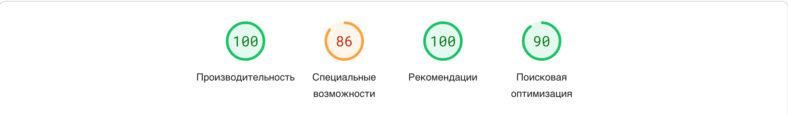
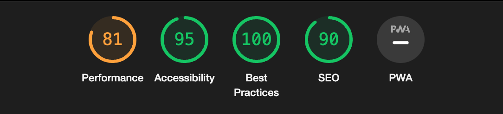

Я намеренно отключаю ховеры после 1024 пикселей, так как после этой ширины экрана, на мой взгляд, пользователи будут в основном взаимодействовать с элементами с помощью тапов или кликов.

Признаю, что проблемы могут возникнуть, исключительно в первом блоке (первой секции) и только с изображениями. Все остальные блоки и элементы, насколько я проверил, соответствуют ожидаемым размерам.

Разработка адаптивного дизайна может быть сложной, поскольку требуется предвидеть различные брейкпоинты экрана. Иногда бывает сложно определить, как будет выглядеть верстка при разных разрешениях экрана без макета.

Важно отметить, что оптимизация изображений и шрифтов заранее может значительно улучшить производительность и быстродействие веб-сайта. Я выиграл около 60% производительности благодаря оптимизации изображений.

О слайдере: Я использовал библиотеку Swiper, чтобы создать слайдер. Попытки заблокировать свайп-жесты и сделать переключение слайдов только по кликам вызывали проблемы с пагинацией. Также, высота изображений персон, кроме Оливера, не соответствует дизайну, и это может вызывать обрезку. Кроме того, не ясно, как должен выглядеть слайдер, если иконок будет больше четырех.

При возникновении любых вопросов, с радостью отвечу!

по pagespeed показатели 

по lighthouse показатели

